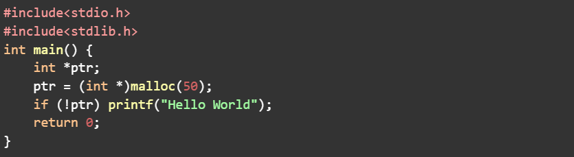
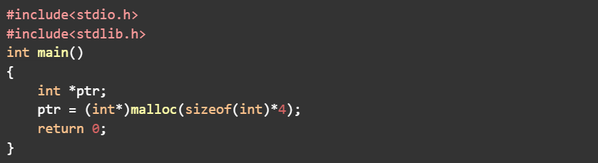
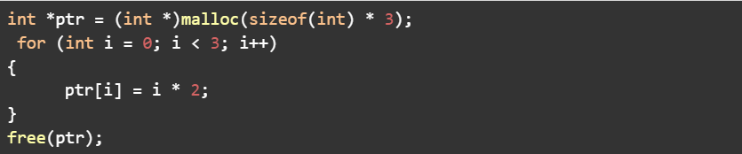
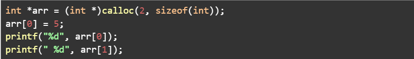
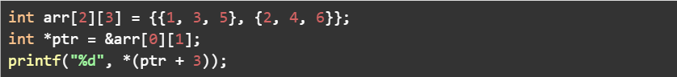

### 1. What is the primary difference between stack and heap memory in C?

**Options:**
- Dynamic memory allocations are made from stack, while static memory allocations are made from heap.
- Memory allocations at stack are made at compile time, while memory allocations at heap are made at runtime.
- Stack memory deals with function call-related operations, while heap memory deals with dynamically allocated memory.
- There is no difference; stack and heap memory are synonymous in C.

> **Correct Answer:** Stack memory deals with function call-related operations, while heap memory deals with dynamically allocated memory.

**Explanation:**
| Feature | Stack Memory | Heap Memory |
| :--- | :--- | :--- |
| **Purpose** | Used for **function calls**, **local variables**, and **return addresses** | Used for **dynamic memory allocation** (`malloc`, `calloc`, `realloc`) |
| **Allocation Time** | Done **automatically** at function call (compile/runtime managed) | Done **manually at runtime** by the programmer |
| **Deallocation** | Automatic — happens when the function exits | Manual — must use `free()` to release memory |
| **Lifetime** | Limited to the function's execution | Persists until explicitly freed |
| **Typical Errors** | Stack overflow (too much recursion or large local arrays) | Memory leaks, dangling pointers |

**In short:**
- **Stack →** automatic, temporary, function-specific memory.
- **Heap →** manual, flexible, runtime memory.

---

### 2. Consider the following code snippet.


Under which of the following conditions, the above program will display “Hello World” as the output?

**Options:**
- If the memory of 50 bytes is successfully allocated.
- If the memory allocation fails.
- It will always display the output as “Hello World”.
- It will never display the output as “Hello World”

> **Correct Answer:** If the memory allocation fails.

**Explanation:**
In the code:
```c
int *ptr;
ptr = (int *)malloc(50);

if (!ptr)
    printf("Hello World");
```
- `malloc(50)` tries to allocate **50 bytes** of memory on the **heap**.
- If the allocation **succeeds**, `malloc()` returns a **non-NULL pointer** (a valid address).
  → Then `!ptr` (NOT ptr) becomes **false**, so `"Hello World"` is **not printed**.
- If the allocation **fails**, `malloc()` returns **NULL**.
  → Then `!ptr` becomes **true**, and `"Hello World"` is **printed**.

**In short:**
- Memory allocated successfully → no output
- Memory allocation failed → prints **Hello World**

---

### 3. Consider the below code snippet.


How much of the memory will be allocated to the pointer “ptr”, assuming the program is being run on a 64-bit architecture?

**Options:**
- 4 bytes
- 8 bytes
- 16 bytes
- 32 bytes
- 256 bits
- 128 bits

> **Correct Answer:** 16 bytes (or equivalently, 128 bits)

**Code:**
```c
#include <stdio.h>
#include <stdlib.h>

int main()
{
    int *ptr;
    ptr = (int*)malloc(sizeof(int) * 4);
    return 0;
}
```

**Step-by-step explanation:**
1. **`sizeof(int)` on a 64-bit architecture:**
   - The size of an `int` is **4 bytes** on both 32-bit and 64-bit systems. (Only pointers become 8 bytes on 64-bit systems, not ints.)

2. **Memory allocated:**
   - The statement `malloc(sizeof(int) * 4)` allocates: `4 bytes × 4 = 16 bytes`

3. So, the total memory allocated to `ptr` is **16 bytes**.

4. In bits: `16 bytes × 8 bits = 128 bits`

---

### 4. Which of the following is the challenge for dynamic memory allocation?

**Options:**
- The dynamic memory cannot be allocated directly from the main function.
- Scope of the pointer referring to the memory must be of char type
- Fragmentation
- None of the above

> **Correct Answer:** Fragmentation

**Explanation:**
**Dynamic memory allocation** allows programs to request memory at runtime using functions like `malloc()`, `calloc()`, and `realloc()`. However, this flexibility comes with some challenges — the most important one being **fragmentation**.

**What is Fragmentation?**
- Over time, as a program repeatedly allocates and frees memory blocks of different sizes, the heap can become **fragmented**.
- This means that **free memory exists**, but it’s **scattered in small, non-contiguous chunks**, making it difficult to fulfill new large allocation requests.

**Why other options are incorrect:**
| Option | Reason |
| :--- | :--- |
| **The dynamic memory cannot be allocated directly from the main function.** | Incorrect — dynamic memory can be allocated anywhere in the program, including `main()`. |
| **Scope of the pointer referring to the memory must be of char type.** | Incorrect — pointer type can be `int*`, `float*`, `char*`, etc. It depends on the data being stored. |
| **None of the above** | Incorrect, because **fragmentation** is a real and well-known challenge. |

**Hence, the challenge for dynamic memory allocation is → `Fragmentation`.**

---

### 5. Consider the code snippet below:


What is the purpose of this code?

**Options:**
- Allocating memory for an array of 3 integers, initializing them to even numbers, and then releasing the allocated memory.
- Allocating memory for an array of 3 integers, initializing them to 0, and then releasing the allocated memory.
- Allocating memory for a single integer, initializing it to 6, and then releasing the allocated memory.
- Allocating memory for an array of 3 integers without initialization.

> **Correct Answer:** Allocating memory for an array of 3 integers, initializing them to even numbers, and then releasing the allocated memory.

**Explanation:**
```c
int *ptr = (int *)malloc(sizeof(int) * 3);
for (int i = 0; i < 3; i++)
{
    ptr[i] = i * 2;
}
free(ptr);
```

**Step-by-step:**
1. `malloc(sizeof(int) * 3)`
   → Allocates space for **3 integers** on the heap. (Total = 3 × 4 bytes = 12 bytes on most systems.)

2. The loop:
   ```c
   for (int i = 0; i < 3; i++)
       ptr[i] = i * 2;
   ```
   initializes:
   - `ptr[0] = 0 * 2 = 0`
   - `ptr[1] = 1 * 2 = 2`
   - `ptr[2] = 2 * 2 = 4`
   → So, the array contains even numbers: **[0, 2, 4]**

3. `free(ptr);`
   → Releases the allocated memory.

**Summary:**
- Allocates memory dynamically for **3 integers**
- Initializes them to **even numbers (0, 2, 4)**
- Frees the allocated memory afterward


### 6. Consider the code snippet given below.


What will be the output of this code?

**Options:**
- 5 5
- 5 Undefined Value
- 5 0
- 5 NULL

> **Correct Answer:** 5 0

**Explanation:**
```c
int *arr = (int *)calloc(2, sizeof(int));
arr[0] = 5;
printf("%d", arr[0]);
printf(" %d", arr[1]);
```

**Step-by-step reasoning:**
1. **`calloc(2, sizeof(int))`**
   - Allocates memory for **2 integers** on the heap.
   - Total allocated space = `2 × sizeof(int)` = `2 × 4 = 8 bytes` (on most systems).
   - **`calloc` initializes all allocated bytes to 0** (unlike `malloc`).

2. **`arr[0] = 5;`**
   - First element is explicitly set to `5`.

3. **`arr[1]`**
   - Second element is not modified, so it remains **0** (because `calloc` initializes memory to zero).

4. **`printf("%d %d", arr[0], arr[1]);`**
   - Prints: `5 0`

**Final Output:**
```text
5 0
```

---

### 7. What is the significance of the expression sizeof(array) / sizeof(array[0]) in C for a 2D integer array?

**Options:**
- It computes the total number of elements in the array.
- It determines the size of the first element in the array.
- It counts the number of rows in the array.
- It counts the number of columns in the array.

> **Correct Answer:** It counts the number of rows in the array.

**Explanation:**
For a 2D array like `int arr[4][5];`:
- `sizeof(arr)` → total size of all elements = `4 * 5 * sizeof(int)`
- `sizeof(arr[0])` → size of one row = `5 * sizeof(int)`
- So, `sizeof(arr) / sizeof(arr[0]) = 4` → number of rows.

---

### 8. In a row-major representation of a 2D array arr[][] with base address 1000, where each element occupies 4 bytes, what is the memory address of arr[3][2] if arr is of size 4 (number of rows) x 5 (number of columns)?
Note: The answer input must be an integer. For Ex: If the answer is 32, you must enter 32 only.

**Row-major representation**
Given:
- Base address = 1000
- Each element = 4 bytes
- Array size = 4 × 5
- Find address of arr[3][2]

**Formula (row-major):**
`Address = Base + W * (C * i + j)`

**Calculation:**
`= 1000 + 4 * (5*3 + 2)`
`= 1000 + 4 * 17`
`= 1000 + 68`
`= 1068`

> **Correct Answer:** 1068

---

### 9. In a column-major representation of a 2D array arr[][] with base address 1000, where each element occupies 4 bytes, what is the memory address of arr[3][2] if arr is of size 4 (number of rows) x 5 (number of columns)?
Note: The answer input must be an integer. For Ex: If the answer is 32, you must enter 32 only.

**Column-major representation**
Given the same details,
**Formula (column-major):**
`Address = Base + W * (R * j + i)`

**Calculation:**
`= 1000 + 4 * (4*2 + 3)`
`= 1000 + 4 * 11`
`= 1000 + 44`
`= 1044`

> **Correct Answer:** 1044

---

### 10. Given the following code, which statements are true?


Select the correct statement:

**Options:**
- The code will print the value at arr[1][0].
- The code will print the value at arr[0][2].
- The code will print the value at arr[1][2].
- The code will print the value at arr[1][1].

> **Correct Answer:** The code will print the value at arr[1][1].

**Analysis:**

**Given code:**
```c
int arr[2][3] = {{1, 3, 5}, {2, 4, 6}};
int *ptr = &arr[0][1];
printf("%d", *(ptr + 3));
```

**Step 1: Understanding the 2D array in memory (row-major order)**
| Element | Index | Memory Order |
| :--- | :--- | :--- |
| `arr[0][0]` | 1 | 1st |
| `arr[0][1]` | 3 | 2nd |
| `arr[0][2]` | 5 | 3rd |
| `arr[1][0]` | 2 | 4th |
| `arr[1][1]` | 4 | 5th |
| `arr[1][2]` | 6 | 6th |

So in linear memory, `arr` looks like this: `[1, 3, 5, 2, 4, 6]`

**Step 2: What does `ptr` point to?**
```c
int *ptr = &arr[0][1];
```
- `arr[0][1]` is the element **3**.
- So `ptr` points to the **second element** in the memory layout.

Thus:
- `ptr → 3`
- `(ptr + 1) → 5`
- `(ptr + 2) → 2`
- `(ptr + 3) → 4`

**Step 3: Expression**
```c
*(ptr + 3)
```
This means the value **3 positions ahead of `arr[0][1]`**, i.e., the **4th value after arr[0][1]**.

From the layout:
```text
[1, 3, 5, 2, 4, 6]
        ↑
       ptr(=arr[0][1])
```
→ `(ptr + 3)` points to `4`, which is `arr[1][1]`.

**Output:**
```text
4
```
