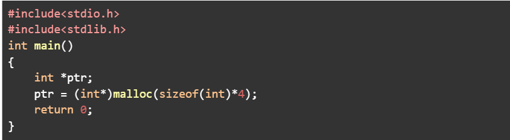
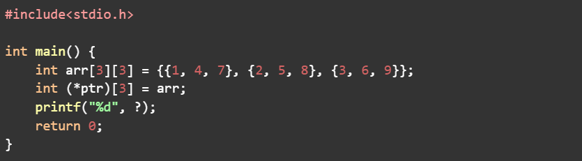
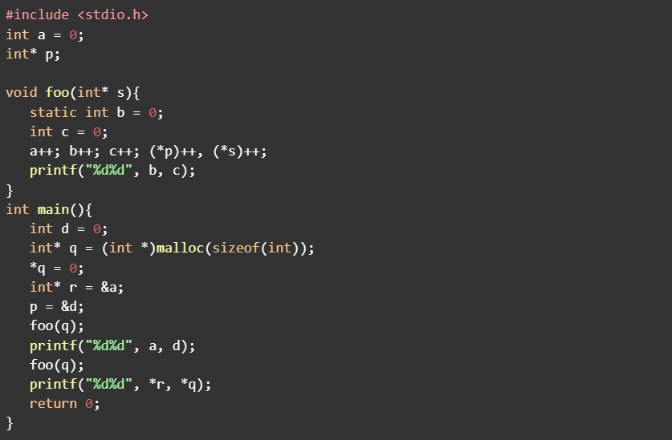

### 1. Which of the following functions is/are used for dynamic memory allocation in C language?

**Options:**
- malloc
- free
- calloc
- realloc

> **Correct Answer:** `malloc`, `calloc`, and `realloc`

**Explanation:**
- `malloc(size)` allocates a single continuous block of memory of `size` bytes. It does not initialize the memory (contents are undefined).
- `calloc(n, size)` allocates space for `n` elements, each of `size` bytes, and initializes all bytes to zero.
- `realloc(ptr, new_size)` resizes a block of memory previously allocated by `malloc` or `calloc`.
- `free(ptr)` is not for allocation; it is used to release memory that was allocated dynamically.

---

### 2. Which of the following statements is/are true regarding dynamic allocation in C language?

**Options:**
- Both malloc and calloc functions are used for allocating memory at run time.
- The malloc function also initializes the allocated memory chunks to zero.
- The free function is used to release a specified block of memory.
- None of the above

> **Correct Answer:** (1) and (3)

**Explanation:**
- Both `malloc` and `calloc` perform memory allocation during program execution (runtime).
- `malloc` does not initialize the allocated memory; it leaves it with indeterminate values.
- `free()` releases the memory that was previously allocated dynamically so that it can be reused.

---

### 3. What is the purpose of the free() function in C dynamic memory allocation?

**Options:**
- Allocate memory
- Release allocated memory
- Reallocate memory
- Copy memory

> **Correct Answer:** Release allocated memory

**Explanation:**
`free()` deallocates a block of memory that was previously allocated by `malloc`, `calloc`, or `realloc`. Failing to free memory leads to memory leaks, as the system cannot reuse the unfreed memory.

---

### 4. Which among the following statements is/are true about dynamic memory allocations in C?

**Options:**
- Memory allocated dynamically can not be released until the program ends.
- Memory allocated dynamically should be released using free() to prevent memory leaks.
- Dynamic memory allocation in C is performed at compile-time.
- Dynamic memory allocation provides flexibility in managing memory during program execution.

> **Correct Answer:** (2) and (4)

**Explanation:**
| Option | Statement | Correct? | Explanation |
| :--- | :--- | :--- | :--- |
| 1 | Memory allocated dynamically cannot be released until the program ends. | ❌ | Wrong — memory can be released anytime with `free()`. |
| 2 | Memory allocated dynamically should be released using free() to prevent memory leaks. | ✅ | Correct — prevents memory leaks by returning heap memory to the system. |
| 3 | Dynamic memory allocation in C is performed at compile-time. | ❌ | Wrong — it happens at runtime, not during compilation. |
| 4 | Dynamic memory allocation provides flexibility in managing memory during program execution. | ✅ | Correct — allows variable-size allocation and efficient memory management. |

---

### 5. In which scenario, using dynamic memory allocation would be particularly advantageous?

**Options:**
- When the memory requirements are fixed and known beforehand.
- When the program has a limited memory footprint.
- When dealing with data structures of varying sizes and uncertain quantities.
- When the program utilizes only stack-based memory.

> **Correct Answer:** When dealing with data structures of varying sizes and uncertain quantities.

**Explanation:**
Dynamic allocation is most useful when the amount of memory needed cannot be known in advance—for example, when creating data structures such as linked lists, trees, or when reading an unknown number of inputs.

| Option | Statement | Correct? | Explanation |
| :--- | :--- | :--- | :--- |
| 1 | When memory requirements are fixed and known beforehand. | ❌ | Static allocation is better; dynamic adds unnecessary complexity. |
| 2 | When the program has a limited memory footprint. | ❌ | Dynamic allocation does not inherently minimize memory usage. |
| 3 | When dealing with data structures of varying sizes and uncertain quantities. | ✅ | Dynamic memory is ideal for runtime flexibility (linked lists, variable input, etc.). |
| 4 | When the program utilizes only stack-based memory. | ❌ | Stack memory is automatically managed; dynamic allocation is not used. |

---

### 6. What happens if the realloc() function fails to resize the allocated memory block?

**Options:**
- It throws a compile-time error.
- It leaves the original memory block intact.
- It automatically frees the memory block.
- It shifts the allocated memory to the stack.

> **Correct Answer:** It leaves the original memory block intact.

**Explanation:**
If `realloc()` fails, it returns `NULL`, but the original pointer and memory block remain unchanged. This ensures that the existing data is not lost when memory reallocation fails.

**Example:**
```c
int *ptr = malloc(10 * sizeof(int));
int *temp = realloc(ptr, 20 * sizeof(int));
if (temp == NULL) {
    // reallocation failed; ptr is still valid
    free(ptr);
}
```

---

### 7. How many elements are there in a 2D array, int matrix[3][4]?

**Options:**
- 7
- 10
- 12
- 24

> **Correct Answer:** 12

**Explanation:**
A 2D array with 3 rows and 4 columns contains `3 × 4 = 12` elements.

---

### 8. In a row-major representation of a 2D array arr[][] with base address B, where each element occupies W bytes, what is the memory address of arr[i][j] if arr is of size R (number of rows) x C (number of columns)?

**Options:**
- `A[i][j] = B + W*(R * i + j)`
- `A[i][j] = B + W*(C * i + j)`
- `A[i][j] = B + W*(C * j + i)`
- `A[i][j] = B + W*(R * j + i)`

> **Correct Answer:** Option 2 `A[i][j] = B + W * (C * i + j)`

**Explanation:**
In row-major order (used by C), elements of each row are stored in consecutive memory locations.
To find the address of `arr[i][j]`:
- Skip `i` complete rows, each having `C` elements.
- Then move `j` elements within the `i`th row.

Hence:
```text
Address = Base + (i * number_of_columns + j) * size_of_each_element
```

---

### 9. In a column-major representation of a 2D array arr[][] with base address B, where each element occupies W bytes, what is the memory address of arr[i][j] if arr is of size R (number of rows) x C (number of columns)?

**Options:**
- `A[i][j] = B + W*(R * i + j)`
- `A[i][j] = B + W*(C * i + j)`
- `A[i][j] = B + W*(C * j + i)`
- `A[i][j] = B + W*(R * j + i)`

> **Correct Answer:** Option 4 `A[i][j] = B + W * (R * j + i)`

**Explanation:**
In column-major order (used by Fortran, MATLAB, etc.), elements of each column are stored consecutively.
To access `arr[i][j]`:
- Skip `j` complete columns, each having `R` elements.
- Then move `i` elements within the current column.

Formula:
```text
Address = Base + (j * number_of_rows + i) * size_of_each_element
```

---

### **Explanation about row-major and column-major**

### **Row-Major Order (used in C, C++, Python)**
- Stores **all elements of each row together** in memory.
- So elements of row 0 come first, then row 1, and so on.
- **Formula:** `Address(arr[i][j]) = B + W * (C * i + j)`
  where `B` = base address, `W` = size of each element, `C` = number of columns.

**Example:**
For a 2×3 array:
```text
1 2 3
4 5 6
```
Memory (row-major): `1, 2, 3, 4, 5, 6`

### **Column-Major Order (used in Fortran, MATLAB)**
- Stores **all elements of each column together** in memory.
- So elements of column 0 come first, then column 1, and so on.
- **Formula:** `Address(arr[i][j]) = B + W * (R * j + i)`
  where `R` = number of rows.

**Example:**
For the same array:
```text
1 2 3
4 5 6
```
Memory (column-major): `1, 4, 2, 5, 3, 6`

---

**In short:**
- **Row-major → rows stored together**
- **Column-major → columns stored together**

---

### 10. Consider the below code snippet.


#### How much of the memory will be allocated to the pointer “ptr”, assuming the program is being run on a 64-bit architecture?

**Options:**
- 4 bytes
- 8 bytes
- 16 bytes
- 32 bytes
- 256 bits
- 128 bits

> **Correct Answer:** 16 bytes and 128 bits

**Code:**
```c
#include <stdio.h>
#include <stdlib.h>

int main()
{
    int *ptr;
    ptr = (int*)malloc(sizeof(int) * 4);
    return 0;
}
```

**Step-by-step reasoning:**
1. **malloc(sizeof(int) * 4)**
   - `sizeof(int)` gives the number of bytes used by an integer.
   - On most systems (including 64-bit systems), `sizeof(int)` = **4 bytes**.

2. The expression:
   ```text
   sizeof(int) * 4 = 4 * 4 = 16 bytes
   ```
   So, malloc allocates **16 bytes** of memory.

3. **Pointer type:**
   - `int *ptr` means `ptr` points to memory that holds integers.
   - Since each int = 4 bytes, 16 bytes = enough space for **4 integers**.

4. The cast `(int*)` converts the `void*` returned by `malloc` into an integer pointer type, though in C it’s not mandatory.

**Final Answer:**
- Memory allocated = **16 bytes**
- Which is equivalent to **128 bits** (since 1 byte = 8 bits)

### 11. Consider the below code snippet.



What should be the value of the “?” so that the program displays “8” as the output?

**Options:**
- *(ptr[1]+2)
- *(ptr[1]+3)
- arr[2][3]
- arr[1][2]

> **Correct Answer:** `*(ptr[1] + 2)` and `arr[1][2]`

**Why:**
- `arr` is `int arr[3][3] = {{1,4,7},{2,5,8},{3,6,9}};`
- `ptr` is a **pointer to an array of 3 ints**: `int (*ptr)[3] = arr;`
  - So `ptr[1]` refers to the **second row** `arr[1]` → `{2, 5, 8}`.
  - `ptr[1]` in an expression decays to `int*` pointing to the first element of that row.
  - `*(ptr[1] + 2)` = element at offset 2 in that row = `arr[1][2]` = `8`.

**Why the others are wrong:**
- `*(ptr[1] + 3)` → tries to access `arr[1][3]`, which is out of bounds (valid column indices are 0..2).
- `arr[2][3]` → also out of bounds for the same reason.

---

### 12. Consider the below code snippet.


Let's carefully go through this C program and understand **which pointers refer to memory in the stack** during execution.

**Code:**
```c
#include <stdio.h>
#include <stdlib.h>

int a = 0;
int* p;

void foo(int* s) {
    static int b = 0;   // static (stored in DATA segment, not stack)
    int c = 0;          // local (stored in STACK)
    a++; b++; c++; (*p)++; (*s)++;
    printf("%d%d", b, c);
}

int main() {
    int d = 0;                      // local (stack)
    int* q = (int*)malloc(sizeof(int));  // dynamically allocated (HEAP)
    *q = 0;
    int* r = &a;                    // points to global (DATA)
    p = &d;                         // p points to stack variable d
    foo(q);
    printf("%d%d", a, d);
    foo(q);
    printf("%d%d", *r, *q);
    return 0;
}
```

**Memory areas in a C program:**
| Area | Typical contents |
| :--- | :--- |
| **Stack** | Local variables, function parameters |
| **Heap** | Dynamically allocated memory (malloc, calloc, etc.) |
| **Data segment** | Global variables, static variables |

**Analysis:**
| Pointer | Description | Points to | Stack? |
| :--- | :--- | :--- | :--- |
| `&a` | Address of global variable `a` | Data segment | ❌ |
| `&b` | Address of static variable `b` | Data segment | ❌ |
| `&c` | Address of local variable `c` (inside `foo`) | Stack (inside foo) | ✅ |
| `&d` | Address of local variable `d` (inside main) | Stack (inside main) | ✅ |
| `&p` | Address of global pointer `p` | Data segment | ❌ |
| `p` | Global pointer pointing to `d` | Stack (points to d) | ✅ |
| `&q` | Address of local pointer `q` (inside main) | Stack | ✅ |
| `q` | Points to malloc memory | Heap | ❌ |
| `&r` | Address of local pointer `r` (inside main) | Stack | ✅ |
| `r` | Points to `a` (global variable) | Data segment | ❌ |
| `&s` | Address of parameter `s` (inside foo) | Stack (foo frame) | ✅ |
| `s` | Pointer parameter (passed to foo, points to heap) | Heap | ❌ |

**Therefore, pointers that point to stack memory at some time:**
- `&c` → local variable in `foo` (stack)
- `&q` → local variable in `main` (stack)
- `&r` → local variable in `main` (stack)
- `&s` → parameter in `foo` (stack)

> **Correct Answer:**
> ```text
> &c
> &q
> &r
> &s
> ```

**Extra clarification:**
- Variables declared **inside functions** (non-static) are always on the **stack**.
- Their **addresses (&variable)** therefore point to stack memory.
- Global and static variables live in the **data segment**, not stack.
- Dynamically allocated variables (`malloc`) live on the **heap**.

---

### 13. What is the output of the C program in question 12?
Note: The answer input must be an integer. For Ex: If the answer is 32, you must enter 32 only.

**Program:**
```c
#include <stdio.h>
#include <stdlib.h>

int a = 0;
int* p;

void foo(int* s) {
    static int b = 0;
    int c = 0;
    a++; b++; c++; (*p)++; (*s)++;
    printf("%d%d", b, c);
}

int main() {
    int d = 0;
    int* q = (int*)malloc(sizeof(int));
    *q = 0;
    int* r = &a;
    p = &d;
    foo(q);
    printf("%d%d", a, d);
    foo(q);
    printf("%d%d", *r, *q);
    return 0;
}
```

**Step 1 — Initial values**
| Variable | Location | Initial Value |
| :--- | :--- | :--- |
| `a` | global | 0 |
| `b` | static (inside foo) | 0 |
| `c` | local (inside foo) | N/A (created each call) |
| `d` | local (main) | 0 |
| `*q` | heap | 0 |
| `r` | points to `a` | |
| `p` | will point to `d` | |

**Step 2 — Execution starts in main()**
```c
p = &d;     // p points to d (stack)
```
Then the first call:
```c
foo(q);
```

**Step 3 — Inside foo(q) (first call)**
Initial values at entry:
`a = 0`, `b = 0`, `*p = d = 0`, `*s = *q = 0`

Now execute:
```c
a++;  // a = 1
b++;  // b = 1 (static, persists between calls)
c++;  // c = 1 (local)
(*p)++;  // d = 1
(*s)++;  // *q = 1
```
Then:
```c
printf("%d%d", b, c);  // prints "11"
```
So far, output: **11**

**Back to main()**
After first call:
`a = 1`, `b = 1` (static), `c` = destroyed, `d = 1`, `*q = 1`

Then:
```c
printf("%d%d", a, d);
```
→ prints `11`

Now output so far: **1111**

**Next call:** `foo(q);`
At entry:
`a = 1`, `b = 1` (static), `*p = d = 1`, `*s = *q = 1`

Execute again:
```c
a++;  // a = 2
b++;  // b = 2 (retains previous value)
c++;  // c = 1 (new local variable)
(*p)++;  // d = 2
(*s)++;  // *q = 2
```
Then:
```c
printf("%d%d", b, c);  // prints "21"
```
Output now: **111121**

Back to `main()`:
```c
printf("%d%d", *r, *q);
```
Here:
`*r = a = 2`, `*q = 2`
Prints `22`

**Final output:** **11112122**

> **Correct Answer:** 11112122

---

### 14. Consider the below code snippet.

**Question:**
We are given:
```c
#include <stdio.h>
#include <stdlib.h>

int main() {
    int n = 6;

    // CODE BLOCK 1 : Missing code block

    for (int i = n; i > 0; i--) {
        q[-i] = i;
    }

    for (int i = 0; i < n; i++) {
        printf("%d", p[i]);
    }

    return 0;
}
```
**Output:** `654321`

We must find the correct missing code block that produces this output.

**Options:**

**1.**
```c
int* p = (int*)malloc(sizeof(int) * n);
int* q = p + n;
```

**2.**
```c
int* p = (int*)malloc(sizeof(int));
int* q = p + n;
```

**3.**
```c
int* p = (int*)malloc(sizeof(int) * n);
int* q = p - n;
```

**4.**
```c
int* p = (int*)malloc(sizeof(int));
int* q = p - n;
```

> **Correct Answer:** Option 1
> ```c
> int* p = (int*)malloc(sizeof(int) * n);
> int* q = p + n;
> ```

**Reasoning:**

1. **What the `for` loop does**
   ```c
   for (int i = n; i > 0; i--) {
       q[-i] = i;
   }
   ```
   If `i = n`, first iteration does:
   `q[-6] = 6`, `q[-5] = 5`, ..., `q[-1] = 1`.
   So, this loop writes **6,5,4,3,2,1** *backwards* in memory relative to pointer `q`.
   That means:
   - `q[-1]` refers to the element *one position before* `q`
   - `q[-n]` refers to *n positions before* `q`
   
   So, the pointer `q` must point **just after the end** of the allocated array `p`, because we are writing backward from it.

2. **what `p` and `q` must be**
   We later print `p[i]` from 0 to 5. Output is `654321`.
   If `q = p + n`:
   - `q[-1] = *(q - 1) = *(p + n - 1) = p[n-1] = 1`
   - ...
   - `q[-6] = p[0] = 6`
   This matches perfectly.

3. **Required allocation**
   We are accessing `p[0]` through `p[5]`, so we need memory for `n` integers: `malloc(sizeof(int) * n)`.

---

### 15. Consider the below code snippet.

**Given Program:**
```c
#include <stdio.h>

int* create_array(int n) {
    int* a;  // (actual implementation missing)
}

int main() {
    int n = 5;
    int* a = create_array(n);
    for (int i = 0; i < n; i++) {
        a[i] = i;
        printf("%d", a[i]);
    }
    return 0;
}
```

**Expected Output:** `01234`

**Goal:**
We must find which versions of `create_array` correctly allocate memory so that `main()` can safely access `a[i]` for `i = 0` to `4`.

**Options:**

**1.**
```c
int* create_array(int n) {
    int a[n];
    return a;
}
```
**Correct?** ❌ Invalid
**Reason:** `a` is a **local array** (stack). Returning a pointer to it destroys integrity once the function returns.

**2.**
```c
int* create_array(int n) {
    int a[n] = (int*)malloc(sizeof(int) * n);
    return a;
}
```
**Correct?** ❌ Invalid
**Reason:** Invalid syntax. You cannot assign a pointer to a statically declared array variable like this.

**3.**
```c
int* create_array(int n) {
    int* a = (int*)malloc(sizeof(int) * n);
    return a;
}
```
**Correct?** ✅ Valid
**Reason:** Memory is dynamically allocated on the **heap** and remains valid after return.

**4.**
```c
int* create_array(int n) {
    return (int*)malloc(sizeof(int) * n);
}
```
**Correct?** ✅ Valid
**Reason:** Same as 3, just shorter.

> **Correct Answer:** Options 3 and 4

**Summary Table:**
| Option | Valid? | Reason |
| :--- | :--- | :--- |
| 1 | ❌ | Returns address of local array (stack memory) |
| 2 | ❌ | Invalid syntax and logic |
| 3 | ✅ | Dynamically allocates memory, returns pointer |
| 4 | ✅ | Same as 3, valid and correct |
